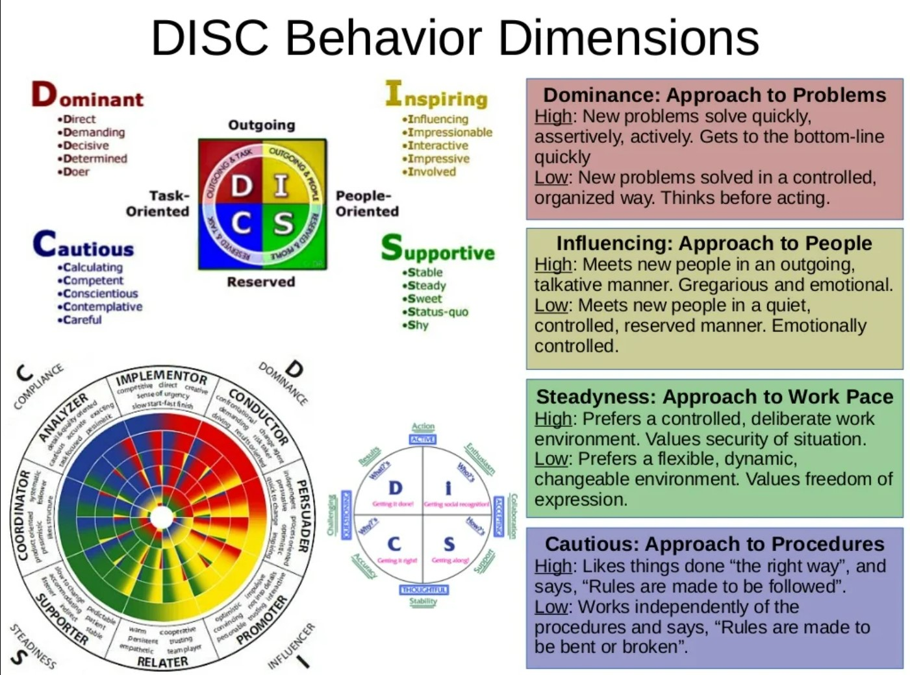

# Factor Of Control

> **Disclaimer:** This prototype only contains only two questions with random aspects of DISC* spectrum; the real test is extensive and accurate in answers weights. This project aims to show the power of DISC capabilities in reducing the time to select and classify possible candidates for a job offer, reducing time, avoiding unnecessary in-person or phone interviews and choosing the right person with the proper behaviour at a specific position. As a result the company reduce the turn over.

##### People are hired chiefly based on their professional skills but fired based on their behaviour.

**Questions like:** What motivated you to apply to this company?, Describe two accomplishments you were proud of in your last role?, How have you overcome conflicts when working with a challenging team member? Why did you leave your last job? What are your strengths and weaknesses? What are your values and what do you want to do in the future? Where did you see you in five years?

All of these questions in the actual interviews scenarios will generate a positive or a negative impression for each candidate based on the feeling of the interviewer perspective (sometimes stressed, overloaded, in a high pace demand, tight deadlines etc). With the help of the DISC algorithm you will be precise saying something like this candidate has a 82.56% match with the job behaviour expectations.

## DISC

The DiSC test is a personality test that is one of the most well known and commonly used. It determines your personality profile based on the DiSC types. We have outlined these below:

 

D: Dominance
Types of behaviours include: focus on achieving results, confidence, seeks a challenge, straight to the point

I: Influence
Types of behaviours include: optimistic, encourages collaboration, persuasive and enthusiastic

S: Steadiness
Types of behaviours include: calm, supportive to others, focus on cooperation, dependable and loyal

C: Conscientiousness
Types of behaviours include: focus on detail, thorough, likes accuracy and independency

# Getting Started with Create React App

This project was bootstrapped with [Create React App](https://github.com/facebook/create-react-app).

## Available Scripts

In the project directory, you can run:

### `npm start`

Runs the app in the development mode.\
Open [http://localhost:3000](http://localhost:3000) to view it in your browser.

The page will reload when you make changes.\
You may also see any lint errors in the console.

### `npm test`

Launches the test runner in the interactive watch mode.\
See the section about [running tests](https://facebook.github.io/create-react-app/docs/running-tests) for more information.

### `npm run build`

Builds the app for production to the `build` folder.\
It correctly bundles React in production mode and optimizes the build for the best performance.

The build is minified and the filenames include the hashes.\
Your app is ready to be deployed!

See the section about [deployment](https://facebook.github.io/create-react-app/docs/deployment) for more information.

### `npm run eject`

**Note: this is a one-way operation. Once you `eject`, you can't go back!**

If you aren't satisfied with the build tool and configuration choices, you can `eject` at any time. This command will remove the single build dependency from your project.

Instead, it will copy all the configuration files and the transitive dependencies (webpack, Babel, ESLint, etc) right into your project so you have full control over them. All of the commands except `eject` will still work, but they will point to the copied scripts so you can tweak them. At this point you're on your own.

You don't have to ever use `eject`. The curated feature set is suitable for small and middle deployments, and you shouldn't feel obligated to use this feature. However we understand that this tool wouldn't be useful if you couldn't customize it when you are ready for it.

## Learn More

You can learn more in the [Create React App documentation](https://facebook.github.io/create-react-app/docs/getting-started).

To learn React, check out the [React documentation](https://reactjs.org/).

### Code Splitting

This section has moved here: [https://facebook.github.io/create-react-app/docs/code-splitting](https://facebook.github.io/create-react-app/docs/code-splitting)

### Analyzing the Bundle Size

This section has moved here: [https://facebook.github.io/create-react-app/docs/analyzing-the-bundle-size](https://facebook.github.io/create-react-app/docs/analyzing-the-bundle-size)

### Making a Progressive Web App

This section has moved here: [https://facebook.github.io/create-react-app/docs/making-a-progressive-web-app](https://facebook.github.io/create-react-app/docs/making-a-progressive-web-app)

### Advanced Configuration

This section has moved here: [https://facebook.github.io/create-react-app/docs/advanced-configuration](https://facebook.github.io/create-react-app/docs/advanced-configuration)

### Deployment

This section has moved here: [https://facebook.github.io/create-react-app/docs/deployment](https://facebook.github.io/create-react-app/docs/deployment)

### `npm run build` fails to minify

This section has moved here: [https://facebook.github.io/create-react-app/docs/troubleshooting#npm-run-build-fails-to-minify](https://facebook.github.io/create-react-app/docs/troubleshooting#npm-run-build-fails-to-minify)
